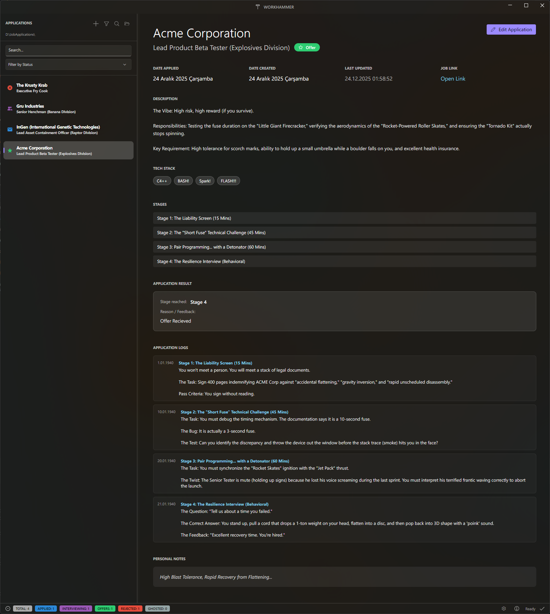

# 🛠️ WorkHammer

A high-fidelity, professional job application tracker designed for developers. Built with **C#**, **Avalonia UI**, and **FluentAvalonia**, providing a native Windows 11 experience on Windows and a polished, cross-platform experience on macOS and Linux.


## ✨ Features

### 🎨 Premium Design
- **Cross-Platform Excellence:** Native look and feel on Windows, macOS, and Linux.
- **Mica & Acrylic Effects:** Full support for Windows 11 translucency (where available).
- **Fluent UI Controls:** Pixel-perfect WinUI 3 styling for inputs, buttons, and dialogs.
- **Editor-Style Sidebar:** A compact, resizable sidebar with modern pill-shaped highlights and professional outline icons.
- **Custom Title Bar:** Immersive, draggable title bar with dedicated WorkHammer branding.

### 📊 Powerful Tracking
- **Smart Sorting:** Sort applications by Name, Status, Date Applied, or Last Update with instant Ascending/Descending toggling.
- **Advanced Filtering:** Live search and status-based filtering to manage long lists effortlessly.
- **Tech Stack Tagging:** Add and remove technology badges (e.g., React, Go, C#) for every job.
- **Live Statistics:** A detailed status bar showing a real-time breakdown of your application pipeline (Applied, Interviewing, Offers, etc.).

### 🛡️ Safety & Reliability
- **Cross-Platform Explorer Integration:** "Reveal in File Explorer/Finder/Files" works seamlessly on Windows, macOS, and Linux.
- **Unsaved Changes Protection:** Native Fluent dialogs warn you before switching views if you have unsaved progress.
- **Safe Delete:** Red-button confirmation for critical actions.
- **Disk-Based Storage:** Data is stored as clean, portable JSON files. Unsaved changes can be discarded by reloading the original state from disk.
- **Middle-Path Truncation:** Long directory paths are elegantly shortened in the sidebar for better readability.

## 🛠️ Tech Stack
- **Framework:** Avalonia UI (Cross-platform .NET)
- **Design System:** FluentAvalonia (WinUI 3 port for Avalonia)
- **Pattern:** Reactive MVVM using CommunityToolkit.Mvvm
- **Language:** C# / .NET 10 (Preview)
- **Data:** JSON Serialization

## 🚀 Getting Started

### Prerequisites
- **.NET 10 SDK** (or latest .NET SDK)
- **PowerShell (pwsh)** (Required for build scripts on macOS/Linux)

### How to Run
1. Open the project folder in a terminal.
2. Run the following command:
   ```bash
   dotnet run
   ```
3. Use the **Select Folder** icon in the sidebar to choose where your job JSON files are stored.

### 📂 Example Workspace
To get started quickly, you can use the `Examples` directory included in this repository. It contains a sample workspace with pre-populated job applications to demonstrate the sorting, filtering, and tagging features.



### ⚙️ Configuration & Storage
WorkHammer stores its configuration in a hidden folder within your user profile to ensure your preferences persist across updates.

- **Location:** `~/wh/settings.json` 
  - *Windows:* `C:\Users\<Name>\wh\settings.json`
  - *macOS/Linux:* `/Users/<Name>/wh/settings.json`

#### Settings Structure
The `settings.json` file uses a simple, human-readable format:

```json
{
  "DataPath": "C:\\Users\\Name\\wh\\jobs",
  "IsTransparencyEnabled": true,
  "WindowWidth": 1000,
  "WindowHeight": 600,
  "CurrentSort": "LastUpdate",
  "IsAscending": false
}
```

#### Field Details:
- **`DataPath`**: The primary workspace directory where your job applications are stored. You can change this at any time using the **Select Folder** icon in the sidebar or by manually updating this path in the `settings.json` file.
- **`IsTransparencyEnabled`**: Enables or disables the modern **Mica/Acrylic** background effects. Disable this if you prefer a solid background or encounter performance issues.
- **`WindowWidth` & `WindowHeight`**: Remembers your preferred application size so it opens exactly where you left off.
- **`CurrentSort` & `IsAscending`**: Automatically persists your last sorting preference (e.g., sorting by "Last Update" in descending order) so your pipeline is always organized how you like it.

### 📦 Publishing & Building

#### 1. Multi-Platform Build (Recommended)
Generates standalone executables and compressed archives for **Windows**, **Linux**, and **macOS (Apple Silicon & Intel)**. 
- **Requirement:** `zip` command-line tool (standard on macOS/Linux) for preserving file permissions.
- **Script:** Run `pwsh ./build_all.ps1`
- **Output:** `./publish_dist/`

#### 2. Windows Standalone (Fastest for Windows)
Generates a single `WorkHammer.exe` for Windows x64.
- **Script:** Run `pwsh ./build_windows.ps1`
- **Output:** `./publish_single/WorkHammer.exe`

---
**Author:** Fezcode (A. Samil Bulbul)  
**Homepage:** [https://fezcode.com](https://fezcode.com)